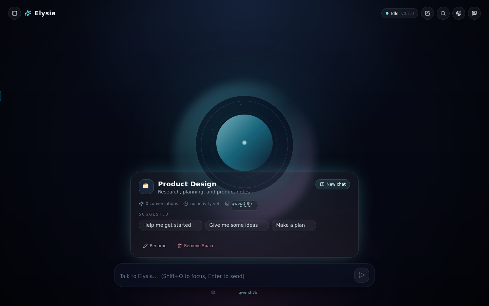

# Elysia

Elysia is a local-first desktop AI companion built with Electron, React, TypeScript, and Ollama. It's designed to feel like an ambient companion presence rather than a chatbot — a breathing orb at the center of the window, not a message thread.



## Current state — Sprint 3: Dynamic Spaces

Sprint 3 makes Elysia project-aware without forcing every conversation into a project. The current
build includes:

- a permanent General Space for everyday chat
- user-created manual Spaces with descriptions, icons, suggestions, and preferred models
- optional native folder binding through the context-isolated Electron preload bridge
- Space-scoped conversations, recent/pinned navigation, and local JSON persistence
- safe folder-context injection using names and shallow metadata only—never file contents
- rename and removal workflows that never modify or delete the bound local folder
- a searchable command palette for Spaces, conversations, and model selection

The screenshot above is a Playwright-verified browser rendering with a mocked preload bridge. Native
folder selection, persistence, and metadata scanning remain Electron-runtime verification paths.

Current safety boundary: no autonomous tools, terminal execution, destructive filesystem actions,
or bulk file-content reading.

## Foundation — Phase 1

The initial companion shell is described in [docs/1stphase.md](docs/1stphase.md):

- Electron desktop runtime
- React + Tailwind renderer
- Central animated orb reflecting assistant state (ready, thinking, generating, offline)
- Floating current-exchange dialogue with a collapsible slide-over for full session history
- Dynamic Space sidebar with local conversation navigation and optional folder bindings
- prompt composer with `Shift+O` global hotkey focus
- streamed Ollama responses from `POST /api/generate`

## Default runtime

- Ollama endpoint: `http://localhost:11434`
- Default model: `gemma4:e4b`

The model is configured in the client state layer and is not hardcoded into the transport itself.

## Development

Install dependencies:

```bash
npm install
```

Run the desktop app in development mode:

```bash
npm run dev
```

If Electron fails on Linux with a missing shared library such as `libasound.so.2`, install the required desktop runtime packages first. On Debian/Ubuntu systems that commonly means at least:

```bash
sudo apt install libasound2 libnss3 libxss1 libgtk-3-0 libxkbcommon0
```

Build the renderer and Electron main/preload bundles:

```bash
npm run build
```

## UI verification with Playwright

The renderer can be smoke-tested in a real browser with Playwright CLI:

```bash
# Terminal 1
npm run dev:renderer -- --host 127.0.0.1

# One-time browser install, then open the renderer
npx --yes --package @playwright/cli playwright-cli install-browser firefox
npx --yes --package @playwright/cli playwright-cli open http://127.0.0.1:5173 --browser firefox
```

Elysia is an Electron app, so a browser-only run must provide a test double for
`window.elysiaDesktop` before reloading the page. The mock should implement the contract in
`src/types/vite-env.d.ts` with in-memory storage and no-op desktop events. Keep Playwright snapshots,
screenshots, and traces under `output/playwright/`.

The browser smoke flow covers:

- loading the General Space and opening the dynamic Space sidebar
- creating a manual Space with a description and preferred model
- confirming that Space suggestions seed and focus the composer
- opening the removal choices for moving conversations to General or deleting them
- opening the command palette and finding the newly created Space

The native folder picker, JSON persistence, and folder metadata scanner depend on Electron IPC and
must be verified in the desktop runtime; a browser preload mock does not validate those native paths.

## Usage

1. Start Ollama and make sure the model you want is pulled and available:

   ```bash
   ollama list
   ```

2. Launch the app (`npm run dev` or the packaged build). The model control defaults to `gemma4:e4b`; enter another pulled model to remember it for the active Space.
3. Type a prompt in the floating command bar and press `Enter` (Shift+Enter for a newline) to send it. The orb shifts from Ready → Thinking → Generating as the response streams in, and the latest exchange appears as a floating card above the command bar.
4. Open the transcript drawer to review the active conversation. Press `Shift+O` anywhere in the window to refocus the composer, or click "New chat" in the Space sidebar to start over.

The sidebar's Status pill reflects live Ollama reachability (checked on load and every 20s), independent of the per-message pipeline state. If Ollama isn't running or the model name doesn't match a pulled model, the assistant reply is replaced with the error returned by Ollama and the orb turns red.

## Spaces

Every conversation belongs to a **Space**, a user-created context that can optionally bind to a
local folder. Only **General** is seeded; project names and folder paths are never hardcoded.
Spaces and conversations persist as local JSON under `data/memory/` (`spaces.json` and
`conversations.json`).

- Open the Space navigator from the top-left panel button to switch contexts, view pinned/recent
  conversations, or create a Space.
- **Add Folder as Space** uses Electron's native folder picker. Manual Spaces need no folder and
  can carry a description, icon, and preferred model.
- Switching Spaces filters conversations, restores the most recent chat, updates suggestions,
  and selects the Space's preferred model when configured.
- A Space home shows its folder binding, model, recent conversations, and safe rename/removal
  actions. Removing a Space never changes its real folder; chats can move to General or be deleted.
- **Inject Folder Context** scans names and lightweight metadata only (depth 3, up to 300 files),
  ignoring common generated/dependency directories. It never reads file contents or runs commands.
- Press **Ctrl/Cmd+K** to search Spaces and conversations, switch contexts, create a Space, or set
  the active Space model.

The architecture keeps Space and conversation concerns separate: `domain/space` and
`domain/conversation` → independent JSON repositories in `services/storage` → `state/spaceStore`
→ `features/spaces`. Folder access stays in the Electron main process behind the preload bridge.

## Structure

```text
electron/               Electron main and preload bridge
src/app                 Renderer bootstrap and application shell
src/components           Shared UI primitives (orb, dialogue, composer, drawers)
src/features/spaces      Space navigator, creator, home, command palette, context
src/domain               Space / conversation / message models and queries
src/services             Ollama transport, JSON storage, folder-context bridge
src/state                Assistant and Space orchestration stores
docs/                    Project specifications
```
